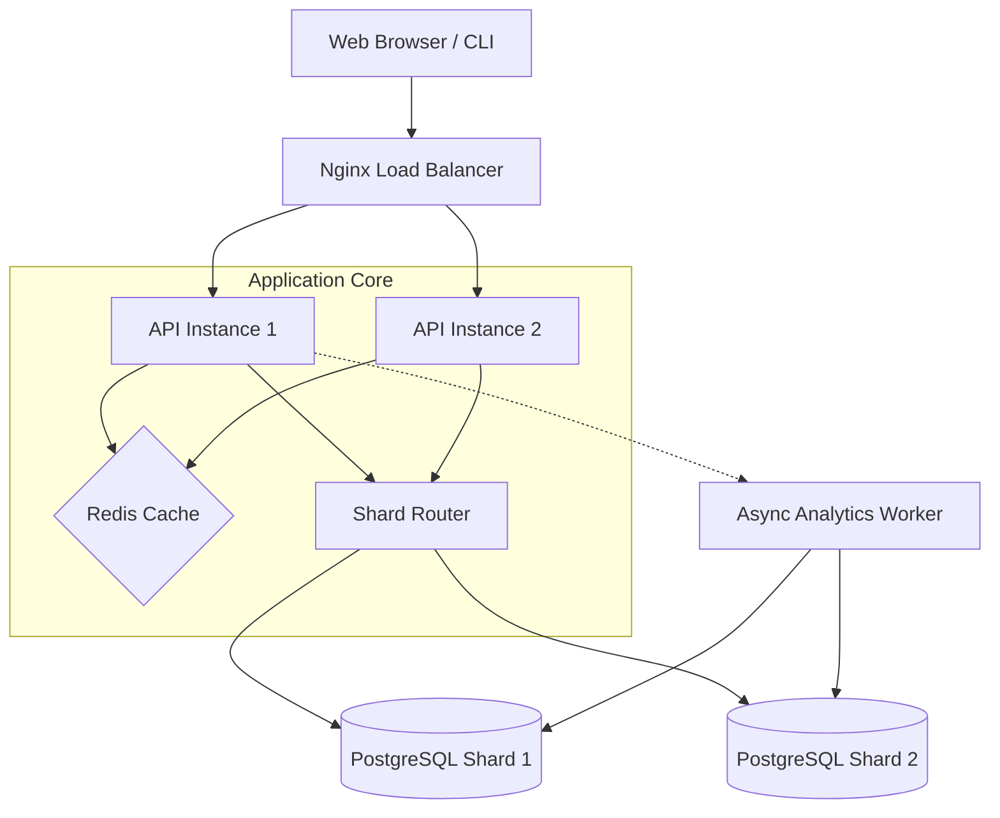

# LinkSwift | High-Scale URL Shortener

LinkSwift is a high-performance, distributed URL shortener built with .NET 8, designed to demonstrate scalability through database sharding, performance caching, and modern architectural patterns.

## 🚀 Key Features

- **Distributed Sharding**: Horizontally scales URL storage and analytics across multiple database shards.
- **Performance Caching**: Redis-backed cache-aside pattern for ultra-low latency redirection.
- **Real-time Analytics**: Asynchronous click tracking with atomic hit counters.
- **Premium Web UI**: Modern glassmorphism interface for link management.
- **Standalone Mode**: Automated fallback to SQLite and In-Memory caching for zero-infrastructure local runs.

---

## 🛠️ Architecture Deep Dive

LinkSwift follows the **Clean Architecture** pattern, ensuring separation of concerns and high testability.

### System Components



### 🎯 Sharding Logic
Data is partitioned across database shards using **Consistent Hashing**:
1. A MurmurHash3 (or similar) of the `ShortCode` is calculated.
2. The hash value is taken modulo the number of active shards.
3. This ensures that a specific `ShortCode` always resides on the same shard, providing O(1) shard resolution.

### ⚡ Caching Strategy
- **Pattern**: Cache-Aside.
- **Hot Path**: Redirects check Redis first. If missing, the DB is queried, and the result is cached for 24 hours.
- **Invalidation**: Deleting a URL automatically purges its Redis entry to maintain consistency.

---

## 📡 API Reference

### Create Short URL
`POST /api/urls`
```json
{
  "originalUrl": "https://example.com/very-long-link"
}
```

### Get Stats
`GET /api/urls/{shortCode}`
Returns click count and basic metadata for a specific short link.

### Redirection
`GET /{shortCode}`
Redirects the client to the original URL with a `302 Found` status.

### Health Check
`GET /health`
Returns a JSON status of system health (DB connection, Cache status).

---

## 🏃 How to Run

### Option A: Standalone Mode (Easiest)
Run natively without any infrastructure dependencies:
1. Ensure .NET 8 SDK is installed.
2. Run the API:
   ```powershell
   dotnet run --project src/UrlShortener.Api
   ```
3. Open **http://localhost:5023/** in your browser.

### Option B: Full Production Mode (Docker)
1. Ensure Docker Desktop is running.
2. Build and launch the cluster:
   ```powershell
   docker compose up --build -d
   ```
3. Access the system via the Load Balancer at **http://localhost/**.

---

## ✅ Verification & Testing

### Performance Target
- **P95 Latency**: < 100ms for redirects.
- **Throughput**: 10,000+ Requests per second (scaled horizontally).

### Automated Tests
Run the included `load-test.js` with k6 to simulate high traffic:
```powershell
k6 run load-test.js
```

## 📂 Project Structure

- `src/UrlShortener.Api`: Web API and UI host.
- `src/UrlShortener.Application`: Business logic (Commands/Queries) and MediatR handlers.
- `src/UrlShortener.Infrastructure`: Persistence (EF Core), Shard Factory, Redis Cache.
- `src/UrlShortener.Domain`: Entities, Value Objects, and Domain Interfaces.
