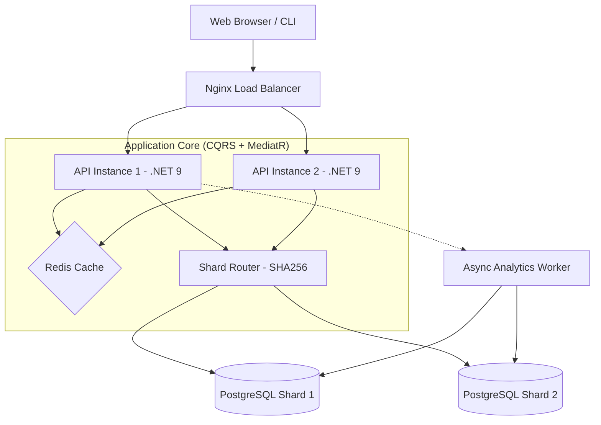

# High-Scale URL Shortener

A high-performance, distributed URL shortener built with **.NET 9**, designed to handle **10M+ requests per day** through database sharding, performance caching, and modern architectural patterns.

**Author:** Chanuka Nimsara  
**Tech Stack:** .NET 9 · PostgreSQL (Sharded) · Redis · EF Core 9 · MediatR · Docker · Nginx · k6

---

## 🚀 Key Features

- **Distributed Sharding**: Horizontally scales URL storage across multiple database shards using **SHA256 hash-based modulo routing** (deterministic across process restarts).
- **Performance Caching**: Redis-backed **cache-aside pattern** with 24h TTL for ultra-low latency redirects.
- **Real-time Analytics**: Asynchronous click tracking with atomic Redis counters and fire-and-forget database persistence (with error logging).
- **Stats API**: Per-URL click statistics endpoint (`GET /api/stats/{code}`).
- **Premium Web UI**: Modern glassmorphism interface for link management.
- **Standalone Mode**: Automated fallback to SQLite when PostgreSQL/Redis are unavailable — zero-infrastructure local runs.
- **16 Unit Tests**: xUnit + Moq covering ShardRouter determinism, ShortCodeGenerator thread-safety, and CQRS handler logic.

---

## 🛠️ Architecture

Follows the **Clean Architecture** pattern (Api → Application → Domain ← Infrastructure) with **CQRS** via MediatR.

### System Components



### 🎯 Sharding Logic

Data is partitioned across database shards using **SHA256 Hash-based Modulo Routing**:

1. A SHA256 hash of the `ShortCode` is calculated — **deterministic across restarts and platforms** (unlike `string.GetHashCode()` which is randomized per-process in .NET Core).
2. The sign bit is cleared via bitwise AND (`& 0x7FFFFFFF`) to avoid `Math.Abs(int.MinValue)` overflow.
3. The result is taken modulo the number of active shards for O(1) shard resolution.

```csharp
var bytes = SHA256.HashData(Encoding.UTF8.GetBytes(shortCode));
var hash = BitConverter.ToInt32(bytes, 0) & 0x7FFFFFFF;
return hash % _shardCount;
```

### ⚡ Caching Strategy

- **Pattern**: Cache-Aside (read-through on miss, write-invalidate on delete).
- **Hot Path**: Redirects check Redis first → DB fallback on miss → populate cache with 24h TTL.
- **Invalidation**: Deleting a URL purges its Redis entry to maintain consistency.
- **Graceful Degradation**: When Redis is unavailable, services resolve it optionally via `IServiceProvider.GetService<IConnectionMultiplexer>()` — no `null!` anti-patterns.

### 🔄 CAP Theorem Decision

This system chooses **AP (Availability + Partition Tolerance)**:
- Eventual consistency accepted for click analytics (fire-and-forget persistence).
- URL redirects remain available even if individual shards or Redis fail.
- Strong consistency maintained for URL creation (write-path goes directly to DB).

---

## 📡 API Reference

| Method | Endpoint | Description | Response |
|:---|:---|:---|:---|
| `POST` | `/api/shorten` | Create short URL | `{ "shortCode": "aBcDeFg" }` |
| `GET` | `/{shortCode}` | Redirect to original | `302 Found` |
| `GET` | `/api/stats/{shortCode}` | Get click statistics | `{ shortCode, originalUrl, totalClicks, createdAt }` |
| `DELETE` | `/api/urls/{shortCode}` | Delete URL + invalidate cache | `204 No Content` / `404` |
| `GET` | `/health` | Health check | `200 OK` |

### Example: Create & Stats

```bash
# Create
curl -X POST http://localhost:5023/api/shorten \
  -H "Content-Type: application/json" \
  -d '{"originalUrl": "https://example.com/very-long-link"}'
# → { "shortCode": "aBcDeFg" }

# Get Stats
curl http://localhost:5023/api/stats/aBcDeFg
# → { "shortCode": "aBcDeFg", "originalUrl": "https://example.com/very-long-link", "totalClicks": 42, "createdAt": "2026-02-24T10:00:00Z" }
```

---

## 🏃 How to Run

### Option A: Standalone Mode (Easiest)

Run natively without any infrastructure dependencies (uses SQLite automatically):

1. Ensure .NET 9 SDK is installed.
2. Run the API:
   ```powershell
   dotnet run --project src/UrlShortener.Api
   ```
3. Open **http://localhost:5023/** in your browser.

### Option B: Full Production Mode (Docker)

Runs 2 API instances, Nginx LB, 2 PostgreSQL shards, and Redis:

1. Ensure Docker Desktop is running.
2. Build and launch the cluster:
   ```powershell
   docker compose up --build -d
   ```
3. Access the system via the Load Balancer at **http://localhost/**.

---

## 📂 Project Structure

```
url-shortener/
├── src/
│   ├── UrlShortener.Api/              # Controllers, Middleware, Program.cs, Web UI
│   ├── UrlShortener.Application/      # Commands, Queries, Interfaces, Services (CQRS)
│   ├── UrlShortener.Domain/           # Entities (ShortUrl, ClickEvent)
│   └── UrlShortener.Infrastructure/   # EF Core, ShardRouter, Redis, Analytics
├── tests/
│   └── UrlShortener.Tests/            # xUnit + Moq (16 tests)
├── docker-compose.yml                 # Multi-container orchestration
├── nginx.conf                         # Load balancer configuration
├── load-test.js                       # k6 load test script
├── chanuka-nimsara-month1-system-design.md   # Deliverable 1
├── chanuka-nimsara-month1-sharding.md        # Deliverable 3
└── chanuka-nimsara-month1-loadtest.md        # Deliverable 4
```

---

## 📋 Submission Documents

| # | Deliverable | File |
|:---|:---|:---|
| 1 | System Design Document | [`chanuka-nimsara-month1-system-design.md`](chanuka-nimsara-month1-system-design.md) |
| 2 | Working Prototype | This repository (source in `src/`) |
| 3 | Database Sharding Implementation | [`chanuka-nimsara-month1-sharding.md`](chanuka-nimsara-month1-sharding.md) |
| 4 | Load Test Results | [`chanuka-nimsara-month1-loadtest.md`](chanuka-nimsara-month1-loadtest.md) |

---

## 🔧 Key Technical Decisions

| Decision | Choice | Rationale |
|:---|:---|:---|
| Hash algorithm | SHA256 (not `GetHashCode()`) | `GetHashCode()` is randomized per-process in .NET Core — would cause data loss across restarts |
| Overflow protection | `& 0x7FFFFFFF` (not `Math.Abs()`) | `Math.Abs(int.MinValue)` throws `OverflowException` |
| Random generation | `Random.Shared` (not `new Random()`) | Thread-safe for concurrent API requests |
| Analytics persistence | Fire-and-forget with `ILogger` | Non-blocking redirects; errors logged, not silently swallowed |
| Redis resolution | `IServiceProvider.GetService<T>()` | Clean conditional registration — no `null!` anti-pattern |
| DbContext disposal | `using var context` | Prevents connection pool exhaustion under sustained load |
