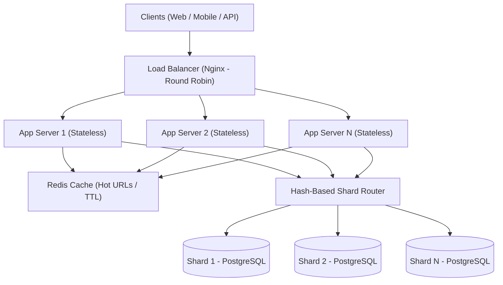
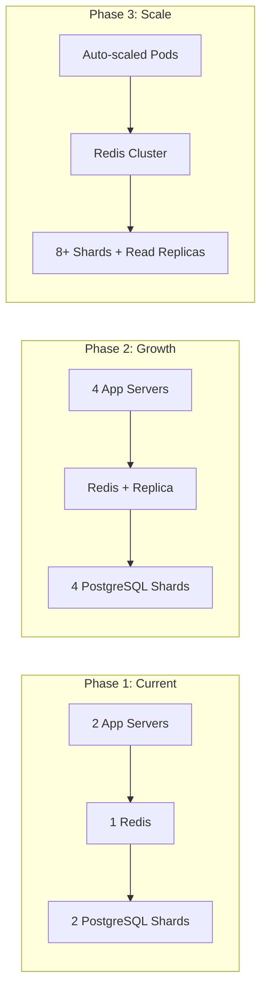

# URL Shortener System Design

**Name:** Chanuka Nimsara  
**Date:** 2026-02-24

---

## 1. Requirements Analysis

### Functional Requirements
- Shorten long URLs to unique 7-character Base62 short codes
- Redirect short URLs to original destinations (302 Found)
- Track click analytics (count, timestamp, referrer, user-agent, IP)
- URL deletion with cache invalidation
- Statistics endpoint per short URL

### Non-Functional Requirements
- 10M+ redirects per day (~115 RPS average, 500+ peak)
- 99.9% availability
- < 100ms redirect latency (P95)
- Data retention: 5 years
- Horizontal scaling ready

### Capacity Estimation

| Metric | Calculation | Result |
|:---|:---|:---|
| **Daily Active Users** | Given | 10M |
| **Writes per day** | New URLs created | 100K |
| **Reads per day** | Redirects | 10M |
| **Read:Write ratio** | 10M / 100K | **100:1** |
| **Average QPS** | 10M / 86,400 | ~115 req/s |
| **Peak QPS** | 115 × 2 | **~230 req/s** |

**Storage (5 years):**
```
100K URLs/day × 500B/record × 365 days × 5 years = ~91 GB
```

**Bandwidth:**
```
230 req/s × 500B = ~115 KB/s
```

**Cache size (20% hot URLs):**
```
10M URLs × 20% × 500B = ~1 GB Redis
```

**URL length:**
```
Base62 characters (a-z, A-Z, 0-9) → 62^7 = 3.5 trillion possible codes
```

### Traffic Patterns
- **Read-heavy workload**: 100:1 read-to-write ratio
- **Hot URLs follow Pareto distribution**: 20% of URLs serve 80% of traffic
- **Spiky traffic**: Viral content can cause sudden 5-10× bursts

---

## 2. High-Level Architecture

### Component Diagram



### Data Flow

**Read Path (Redirect):**
```
Client → Load Balancer → App Server → Redis Cache → DB (on cache miss)
```

1. Client sends `GET /{shortCode}`
2. Nginx round-robins to a stateless app server
3. App checks Redis cache (`url:{shortCode}`)
4. **Cache HIT**: Return 302 redirect immediately (~1ms)
5. **Cache MISS**: Shard router calculates `hash(shortCode) % N` → correct PostgreSQL shard
6. Fetch URL from shard, populate cache with TTL, return 302

**Write Path (Create):**
```
Client → Load Balancer → App Server → DB → Invalidate Cache
```

1. Client sends `POST /api/shorten` with `{ "originalUrl": "..." }`
2. Generate 7-char Base62 code using `Random.Shared` (thread-safe)
3. Route to correct shard via hash function
4. INSERT with collision retry (up to 5 attempts)
5. Return short code

### Technology Choices

| Component | Choice | Rationale |
|:---|:---|:---|
| **Runtime** | .NET 9 | High-performance, async-first, cross-platform |
| **Architecture** | Clean Architecture + CQRS (MediatR) | Separation of concerns, testable |
| **Primary DB** | PostgreSQL (sharded) | ACID compliance, proven at scale |
| **Cache** | Redis (cache-aside) | Sub-ms reads, atomic operations for analytics |
| **Load Balancer** | Nginx | Round-robin, health checks, static file serving |
| **Containerization** | Docker Compose | Multi-service orchestration |

---

## 3. Database Design

### Schema Design

```sql
-- Applied identically to each PostgreSQL shard
CREATE TABLE "ShortUrls" (
    "Id"          UUID PRIMARY KEY,
    "ShortCode"   VARCHAR(10) NOT NULL UNIQUE,
    "OriginalUrl" TEXT NOT NULL,
    "CreatedAt"   TIMESTAMP WITH TIME ZONE NOT NULL DEFAULT NOW()
);

CREATE UNIQUE INDEX idx_shorturl_code ON "ShortUrls" ("ShortCode");

CREATE TABLE "ClickEvents" (
    "Id"         UUID PRIMARY KEY,
    "ShortCode"  VARCHAR(10) NOT NULL,
    "IpAddress"  VARCHAR(45),
    "UserAgent"  TEXT,
    "Referer"    TEXT,
    "OccurredAt" TIMESTAMP WITH TIME ZONE NOT NULL DEFAULT NOW()
);

CREATE INDEX idx_click_shortcode ON "ClickEvents" ("ShortCode");
CREATE INDEX idx_click_occurred ON "ClickEvents" ("OccurredAt");
```

### Sharding Strategy
- **Algorithm**: Hash-based (`SHA256(shortCode) % shardCount`)
- **Shard key**: `ShortCode` — present in every read, write, and delete operation
- **Initial configuration**: 2 shards, expandable to N
- See dedicated sharding document for full details

### Index Strategy
- **`ShortCode` UNIQUE index** on ShortUrls — O(1) lookup for redirects (the hot path)
- **`ShortCode` index** on ClickEvents — efficient per-URL analytics aggregation
- **`OccurredAt` index** on ClickEvents — time-range analytics queries
- No foreign keys between tables to avoid cross-entity locking during high write throughput

---

## 4. Caching Strategy

### What to Cache
- **Hot URL mappings**: `url:{shortCode}` → `originalUrl` (reduces DB load by 80%+)
- **Analytics counters**: `clicks:{shortCode}` — atomic Redis increment for real-time counts
- **Recent short codes**: Recently created URLs are likely to be accessed soon

### Cache-Aside Pattern Implementation

```csharp
// 1. Try cache first
var cached = await _cache.GetAsync("url:" + shortCode);
if (cached != null) return cached;

// 2. Cache miss - query correct shard
var shardIndex = _router.GetShardIndex(shortCode);
var url = await _db.ShortUrls.FirstOrDefaultAsync(u => u.ShortCode == shortCode);

// 3. Populate cache with TTL
if (url != null)
    await _cache.SetAsync("url:" + shortCode, url.OriginalUrl, TimeSpan.FromHours(24));

return url;
```

### Cache Invalidation
- **TTL expiration**: 24-hour TTL for URL mappings — balances freshness vs. cache hit rate
- **Write-through on delete**: `DELETE /api/urls/{code}` immediately removes the Redis key
- **LRU eviction**: Redis `maxmemory-policy allkeys-lru` handles memory pressure automatically

### Cache Sizing
```
20% of daily active URLs × 500B average = ~1 GB Redis
Expected hit rate: 80%+ (Pareto distribution of hot URLs)
```

### Failure Handling
Cache is **optional** — the system gracefully degrades to direct DB queries. `RedisCacheService` wraps all operations in try-catch, returning null on failure. No data loss, only latency increase (~10-50ms vs ~1ms).

---

## 5. Trade-off Analysis

### CAP Theorem Decisions

This system chooses **AP (Availability + Partition Tolerance)** — the same choice as DynamoDB and Cassandra.

| Property | Decision | Rationale |
|:---|:---|:---|
| **Consistency** | Eventual | Redis cache may serve slightly stale data (max 24h TTL). Acceptable: URL mappings rarely change after creation. |
| **Availability** | ✅ High priority | 99.9% target. Graceful degradation: Redis → DB fallback, PostgreSQL → SQLite fallback. Stateless app servers allow instant horizontal scaling. |
| **Partition Tolerance** | ✅ Built-in | Shards are independent — a network partition isolating Shard 2 only affects URLs hashed to that shard. No cross-shard transactions. |

**Why AP over CP?**  
URL shorteners serve redirects — returning a cached (potentially stale) URL is always better than returning an error. Users expect the service to be available, and eventual consistency (24h max staleness) is perfectly acceptable for URL mappings that almost never change.

### Consistency vs Availability Choices

| Decision | Consistency | Availability | Why |
|:---|:---|:---|:---|
| Cache-aside with TTL | Eventual (24h) | ✅ High | URL mappings are immutable after creation |
| Fire-and-forget analytics | ❌ Possible loss | ✅ Non-blocking | Losing a few click events < slowing every redirect by 30ms |
| Shard-local operations | ✅ Strong per-shard | Partial (per-shard) | No cross-shard coordination needed |
| Delete cache invalidation | ✅ Immediate | ✅ High | Destructive ops need strong consistency |

### Cost vs Performance Trade-offs

| Trade-off | Choice | Alternative | Rationale |
|:---|:---|:---|:---|
| **SHA256 hash routing** | Deterministic, safe | MD5 (faster) | SHA256 prevents hash collision attacks; negligible performance difference (~200ns/call) |
| **7-char Base62 codes** | 3.5T namespace | Counter-based (sequential) | No coordination needed across app instances; collision probability negligible at our scale |
| **In-process analytics** | Fire-and-forget `Task.Run` | Message queue (RabbitMQ) | Simpler deployment; queue adds operational complexity for a non-critical path |
| **Hash-mod sharding** | Simple, even distribution | Consistent hashing ring | Consistent hashing adds complexity; hash-mod sufficient for planned (not auto-scaling) shard counts |

---

## 6. Scaling Strategy

### Horizontal Scaling Approach



| Component | How It Scales | Trigger |
|:---|:---|:---|
| **App servers** | Add more stateless instances behind Nginx | CPU > 70% or RPS > capacity |
| **Redis cache** | Add read replicas, then Redis Cluster | Memory > 80% or hit rate < 70% |
| **PostgreSQL** | Add shards (hash-mod redistribution) | Shard storage > 50 GB or query latency > 50ms |

### Bottleneck Identification

| Bottleneck | When | Solution |
|:---|:---|:---|
| **Single DB shard** | Write contention at 500+ writes/s | Add more shards |
| **Redis memory** | Hot set exceeds single node RAM | Redis Cluster |
| **Network I/O** | Cross-AZ latency on reads | Co-locate app + cache in same AZ |
| **Click event writes** | Analytics writes compete with URL reads | Separate analytics DB or async queue |

### Future Growth Plan

| Phase | Capacity | Changes |
|:---|:---|:---|
| **P1** (0-10M/day) | 2 shards, 2 app servers, 1 Redis | Current setup |
| **P2** (10-50M/day) | 4 shards, 4 app servers, Redis replica | Data migration, add CDN |
| **P3** (50M+/day) | 8+ shards, K8s auto-scaling, Redis Cluster | Read replicas per shard, CDN caching, time-partitioned click events |
